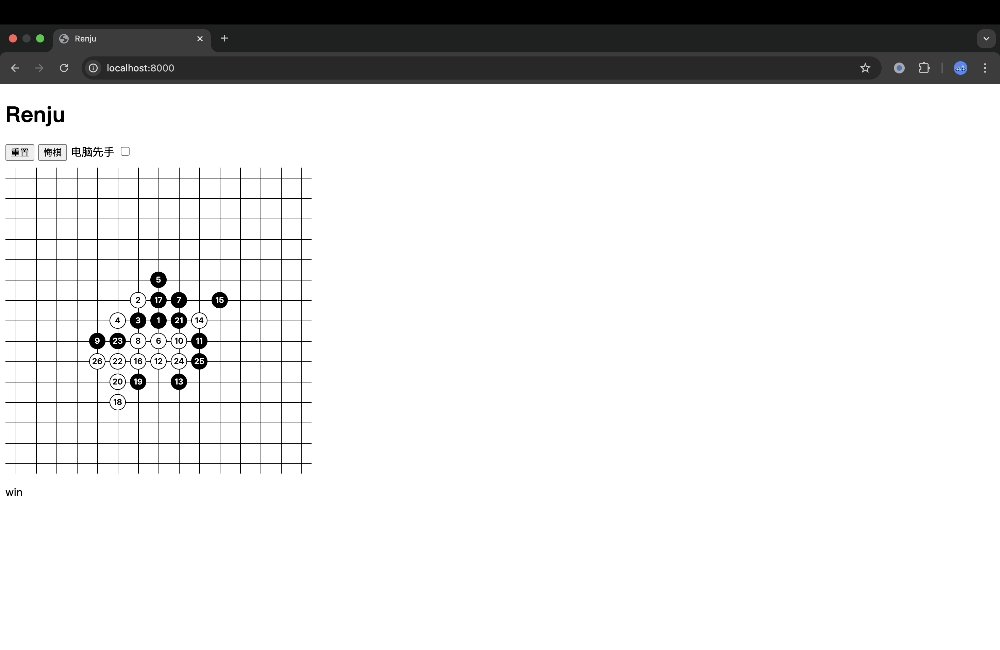

# Renju-Web

A simple web UI compatible with bots using [botzone simplified I/O protocol](https://wiki.botzone.org.cn/index.php?title=Bot#.E4.BA.A4.E4.BA.92).

Usage:

1. Launch `server.py` with the path of bot (executable file), e.g. `python server.py ../bin/botzone`

2. Open website by `anywhere` (maybe need to install `anywhere` by `npm install anywhere -g` first)

note: If port conflicts with any other program, try execute `anywhere -p [new port]` for website, or modify `config.json` for server.

